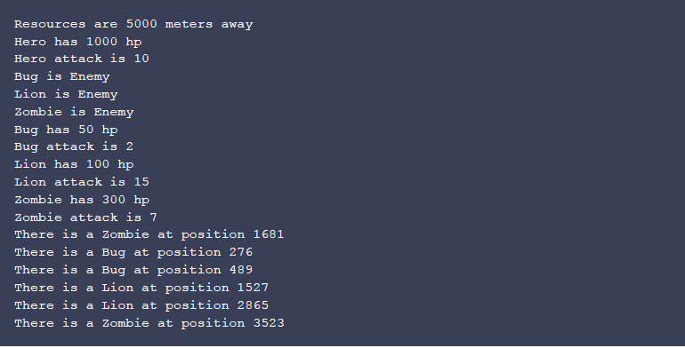

# survival-simulate

### Summary
- Backend simulation application developed with java.

A simulation has been developed that can simulate whether a volunteer will reach resources and survive.
If  volunteer confronts an enemy, he must fight against him.
There will be voluntary and enemy attacks to simulate fights.
Each enemy has attack power and health.
Each attack decreases health points equal to attack.

### Sample input

### Sample output

